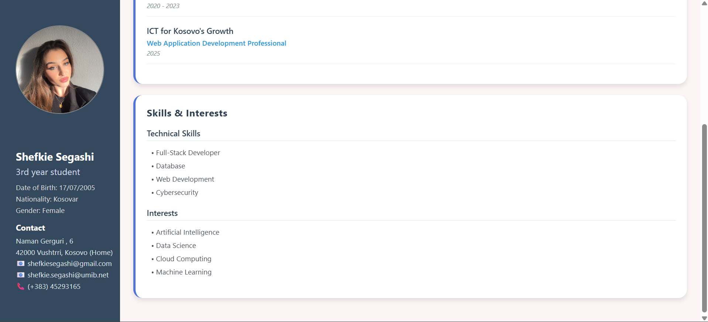

# CV React Native App

This is a CV app built with **React Native**.  
It displays personal information, education, skills, interests, and screenshots of the app.

## How to run

```bash
# Clone the repository
git clone https://github.com/shefkiees/CVApp.git

# Go to project folder
cd CV-StaticPage

# Install dependencies
npm install

# Start the app
npx expo start
```   <-- kjo pjesë ishte munguar

## Screenshots



